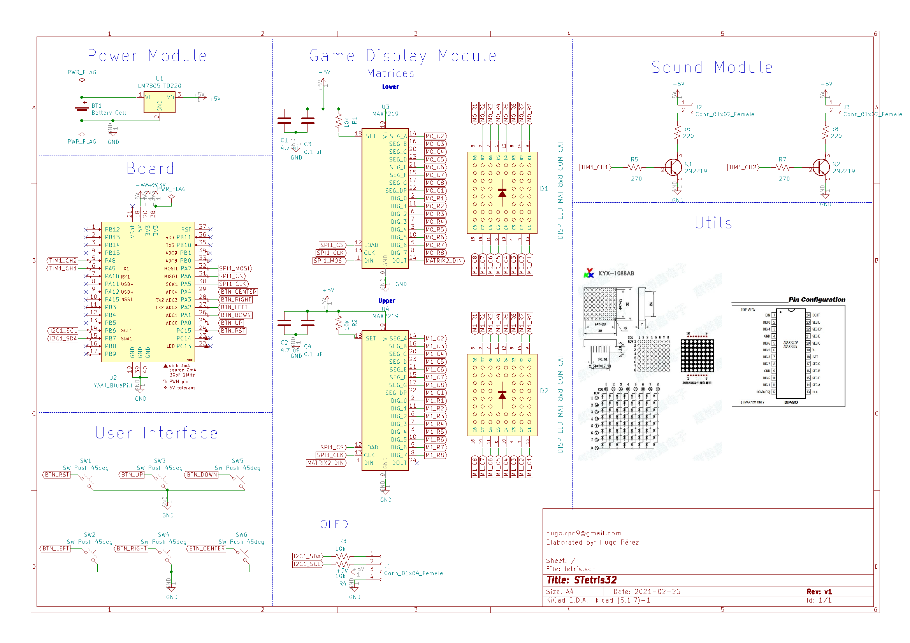

# STetris32
My version of the famous game "Tetris" using a system based on the Blue Pill dev board.
## Information
The sole purpose of this project is to recreate the game mechanics and introduce some other different features regarding in-game audio :). 
## Block Diagram

The system can be summarized in three big modules:
1. Game Display Module.
    - SPI communication with MAX7219 to control two 8x8 LED matrices.
    - I2C communication with SSD1306 OLED Driver connected to 128x64 dot display to show the player's score and the current song being played.
2. Sound Module.
    - PWM + NPN BJT circuit driven 4 ohm speakers.
3. User Interface Module.
    - 6 buttons with different functionalities (up/down/left/right/center/reset).
## Schematic
The connections the user must make are the following:

## Video

Pending upload.

## Useful Information
- [OLED Display](https://controllerstech.com/oled-display-using-i2c-stm32/)
- [Matrices](https://acoptex.com/project/160/basics-project-032a-8x8-dot-led-matrix-64-led-digital-display-common-anode-and-common-cathode-at-lex-c/)
