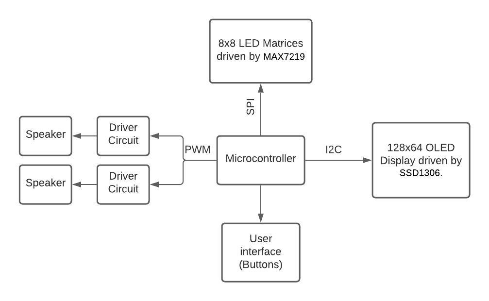

# STetris32
My version of the famous game "Tetris" using a system based on the Blue Pill dev board.

## Information
The sole purpose of this project is to recreate the game mechanics and introduce some other different features regarding in-game audio :). 

---
## Block Diagram

The system can be summarized in three big modules:
1. Game Display Module.
    - Two 8x8 LED Matrices connected to the board via SPI.
    - An OLED Display connected via I2C to show the player's score and the current song being played.
2. Sound Module.
    - 12 bit DAC module connected to a speaker to play different game tracks.
    - SD Card Module to save all tracks.
3. User Interface Module.
    - 5 buttons with different functionalities.

---
## Video

Pending upload.
